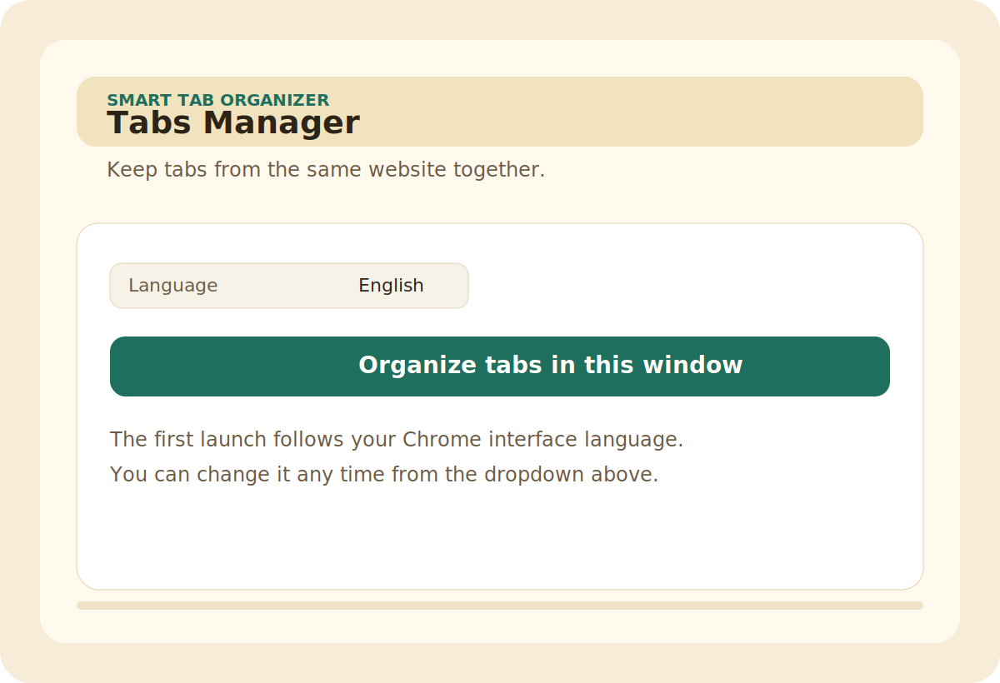
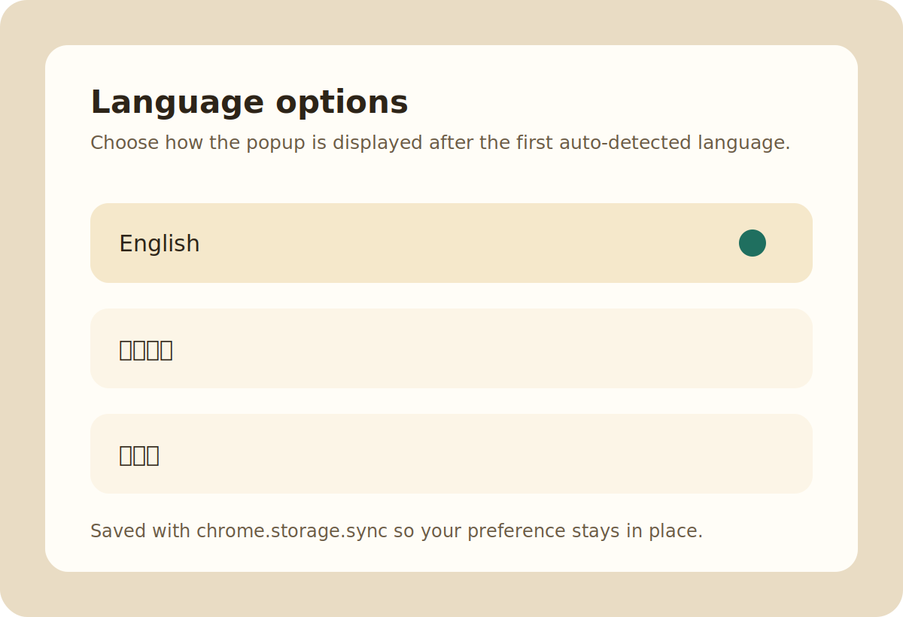

# Tabs Manager

Tabs Manager is a lightweight Chrome extension that keeps tabs from the same website next to each other, making busy windows easier to scan.

Tabs Manager 是一個輕量的 Chrome 擴充功能，會把相同網站的分頁排在一起，讓分頁很多的視窗更容易整理。

Tabs Manager は、同じサイトのタブを隣同士に並べて整理できる軽量な Chrome 拡張機能です。

## Screenshots

High-resolution PNG assets for Chrome Web Store listing:

- `assets/store-screenshot-1.png`
- `assets/store-screenshot-2.png`
- `assets/icon-128.png`

## Features

- Group tabs by domain in the current Chrome window
- Keep the original order inside each website group
- Follow the Chrome UI language on first launch
- Let you switch language manually and save the preference

## Supported Languages

- English
- Traditional Chinese
- Japanese

## Installation

1. Open Chrome and go to `chrome://extensions`
2. Enable `Developer mode`
3. Click `Load unpacked`
4. Select this folder

## Usage

1. Click the Tabs Manager icon in Chrome
2. Check the language selector if you want to change the display language
3. Click `Organize tabs in this window`
4. Tabs from the same website will be moved next to each other

## Chrome Web Store Assets

- Store listing copy: `docs/chrome-web-store-listing.md`
- Privacy policy: `docs/privacy-policy.md`
- Icons: `assets/icon-16.png`, `assets/icon-32.png`, `assets/icon-48.png`, `assets/icon-128.png`
- Listing screenshots: `assets/store-screenshot-1.png`, `assets/store-screenshot-2.png`

## Notes

- The initial language follows `chrome.i18n.getUILanguage()`, which matches your Chrome interface language
- Chrome extensions cannot directly read your Google account language setting, so the browser UI language is used as the closest reliable source
- Special pages such as `chrome://` are placed near the end of the tab order
